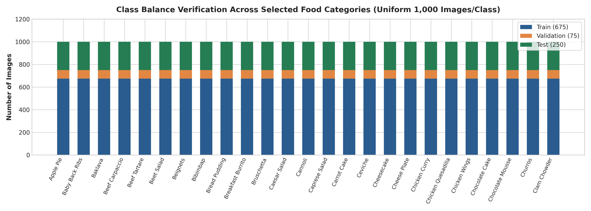
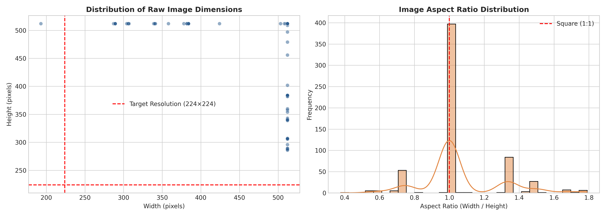
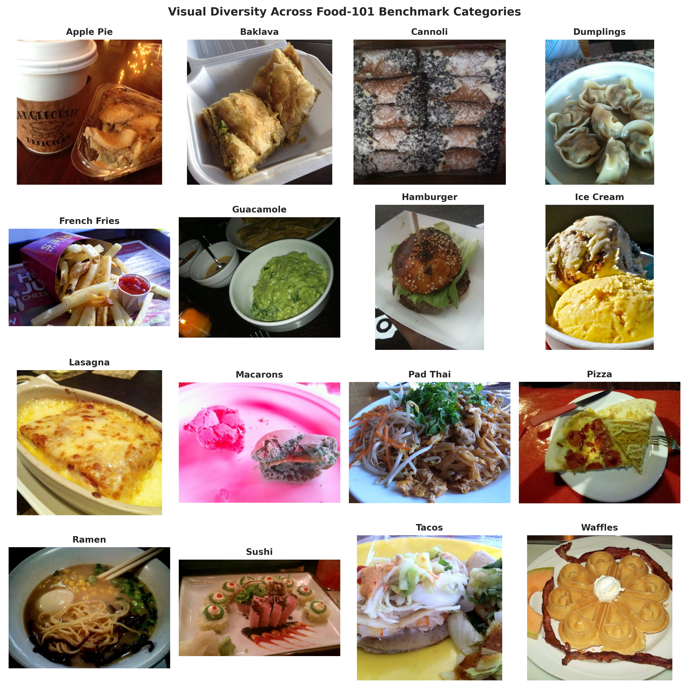
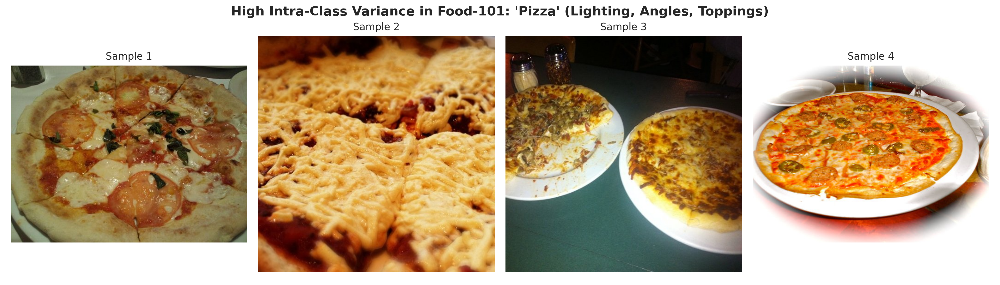
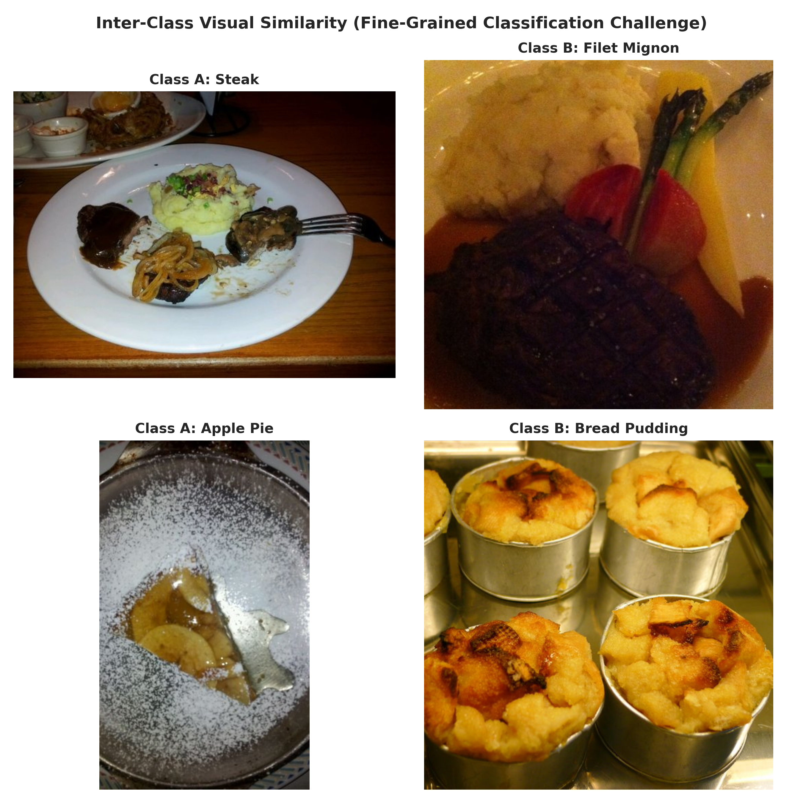

# Section 3: Dataset Description and Exploratory Data Analysis

**Author:** Nirmana (Group Leader / Member 1)  
**Assigned Workstream:** Repository Scaffolding, Data Pipeline, EDA, Custom CNN, Integration  
**Academic Module:** SE4050 — Deep Learning (2026)  
**Institution:** Sri Lanka Institute of Information Technology (SLIIT)  

---

## 3.1 Dataset Provenance, Metadata and Context

The dataset selected for this study is the **Food-101** benchmark dataset, introduced by Bossard, Guillaumin, and Van Gool at the *European Conference on Computer Vision (ECCV)* in 2014 [1]. Food-101 was developed as a standardized benchmark for fine-grained food-image recognition and contains a diverse collection of real-world food photographs spanning 101 culinary categories.

Unlike small and highly controlled image-classification datasets, Food-101 contains substantial natural variation in food presentation, image composition, background clutter, camera viewpoint, and illumination conditions. This makes the dataset suitable for evaluating deep-learning architectures under conditions that closely represent unconstrained, real-world visual imagery.

The complete dataset contains 101,000 RGB images distributed equally across 101 food categories, with exactly 1,000 images assigned to each category. The original dataset provides 750 training images and 250 test images for each class. For the present study, the original training portion was further divided into training and validation subsets, while the original test portion was retained exclusively for final evaluation to prevent data leakage.

### Table 3.1: Food-101 Dataset Metadata

| Attribute | Specification |
| :--- | :--- |
| **Dataset** | Food-101 |
| **Original source** | Computer Vision Laboratory, ETH Zürich |
| **Authors** | Lukas Bossard, Matthieu Guillaumin, and Luc Van Gool |
| **Publication** | ECCV 2014 [1] |
| **Total images** | 101,000 |
| **Number of classes** | 101 |
| **Images per class** | 1,000 |
| **Original training set** | 75,750 images |
| **Original test set** | 25,250 images |
| **Project training set** | 68,175 images |
| **Project validation set** | 7,575 images |
| **Final test set** | 25,250 images |
| **Image representation** | RGB JPEG images |
| **Classification task** | 101-class fine-grained food-image classification |

The empirical dataset statistics obtained from the project's EDA notebook (`notebooks/01_food101_eda.ipynb`) confirm the expected dataset scale and class structure. The resulting project partition contains 68,175 training images, 7,575 validation images, and 25,250 final test images, yielding a total of 101,000 images.

---

## 3.2 Dataset Volume, Class Distribution and Split Verification

An initial dataset audit was performed to verify the number of classes, total images, and class distribution before model development. The analysis confirmed the presence of 101 food categories and 101,000 images.

The original training portion was partitioned using a deterministic procedure (`src/data/split_food101.py`) into 68,175 training images and 7,575 validation images with a locked random seed of `42`. The original test portion was maintained separately, resulting in 25,250 images reserved for final evaluation.

The class-level analysis confirmed that the resulting partition is exactly balanced. Each category contains:

$$675 \text{ training images}$$
$$75 \text{ validation images}$$
$$250 \text{ test images}$$

Therefore, every category contains exactly:

$$675 + 75 + 250 = 1,000 \text{ images}$$

across the complete dataset.

### Table 3.2: Verified Class Distribution Across the Experimental Splits

| Split | Images per class | Number of classes | Total images | Percentage of Dataset |
| :--- | :---: | :---: | :---: | :---: |
| **Training** | 675 | 101 | 68,175 | 67.5% |
| **Validation** | 75 | 101 | 7,575 | 7.5% |
| **Final Test** | 250 | 101 | 25,250 | 25.0% |
| **Total** | **1,000** | **101** | **101,000** | **100.0%** |

The verification showed identical minimum and maximum class counts within each split: 675 for training, 75 for validation, and 250 for testing. Consequently, no class-level imbalance exists in the dataset partition.

### Figure 3.1: Class Balance Verification Across Selected Food Categories



*Figure 3.1: Distribution of training (675), validation (75), and test (250) images for 25 representative Food-101 categories. The identical stacked bars demonstrate the strictly uniform class structure of the dataset.*

The balanced structure is advantageous for comparative evaluation because differences in overall accuracy are not caused by unequal numbers of examples among the food categories. Nevertheless, equal class frequencies do not imply equal classification difficulty. Categories can still differ considerably in their visual characteristics and the degree of similarity they share with other classes. Therefore, class-level performance and confusion patterns remain important components of the subsequent evaluation.

---

## 3.3 Image Resolution, Aspect Ratio and Colour Characteristics

Food-101 images were further examined to determine the variation in their original spatial characteristics. A random sample of 600 training images was selected using a fixed random seed of `42`. The width, height, aspect ratio, and colour mode of each sampled image were recorded.

The analysis found that the sampled images varied considerably in spatial dimensions. The minimum observed resolution was $193 \times 286$ pixels, while the maximum was $512 \times 512$ pixels. The mean aspect ratio across the sample was approximately **1.06**, indicating that the dataset contains both approximately square images and images with rectangular compositions.

All 600 sampled images were identified as RGB images, with no grayscale or alternative colour-mode images detected in the sample.

### Figure 3.2: Distribution of Raw Image Dimensions and Aspect Ratios



*Figure 3.2: Spatial characteristics of the sampled Food-101 images. Left: Scatter plot of raw image width versus height against our standardized $224 \times 224$ input resolution (red dashed line). Right: Histogram of aspect ratios showing primary peaks around square (1:1) and rectangular (4:3) orientations.*

The observed dimensional variation has direct implications for model preprocessing. Since the four architectures require a consistent tensor input, raw images must be transformed into a common spatial representation before being passed to the networks. The project therefore uses **$224 \times 224 \times 3$** as the standard input representation.

However, resizing images to a fixed resolution can alter their original spatial proportions if aspect ratios are not explicitly considered. This issue is therefore relevant when interpreting model performance and will be addressed in the preprocessing methodology described in Section 4.

---

## 3.4 Visual Diversity and Category Representation

A qualitative visual analysis was conducted to examine the range of food categories and image appearances represented in Food-101. Sixteen representative categories were selected from the validation split, including `apple_pie`, `baklava`, `cannoli`, `dumplings`, `french_fries`, `guacamole`, `hamburger`, `ice_cream`, `lasagna`, `macarons`, `pad_thai`, `pizza`, `ramen`, `sushi`, `tacos`, and `waffles`.

### Figure 3.3: Visual Diversity Across Representative Food-101 Categories



*Figure 3.3: Representative images from 16 Food-101 categories, demonstrating extensive variation in food geometry, surface texture, color palette, cooking style, plating, and visual context.*

The visual sample demonstrates that the classification problem spans substantially different types of food. Some categories have relatively distinctive structures, whereas others consist of complex combinations of ingredients with less clearly defined boundaries. For example, foods such as waffles and hamburgers contain recognizable structural patterns, while dishes such as pad thai, lasagna, and ramen exhibit considerable variation depending on ingredients and presentation.

The images also contain contextual information such as plates, tables, utensils, sauces, garnishes, and surrounding tableware. As a result, a model must learn features that are sufficiently discriminative to identify the food itself without becoming overly dependent on irrelevant background characteristics.

---

## 3.5 Intra-Class Variation and Inter-Class Visual Similarity

The EDA further examined two visual characteristics that contribute to the difficulty of the classification problem: intra-class variation and inter-class similarity.

### 3.5.1 Intra-Class Variation

Intra-class variation refers to differences between images belonging to the same category. To illustrate this phenomenon, four training images from the `pizza` category were examined.

### Figure 3.4: Intra-Class Variation Within the Pizza Category



*Figure 3.4: Differences in visual appearance among images assigned to the 'Pizza' category, illustrating variations in viewpoint (overhead vs. perspective), scale (whole pizza vs. single slice), toppings, illumination, and background context.*

The four examples demonstrate that the semantic identity of a food category cannot necessarily be represented by one fixed visual template. The appearance of pizza changes according to the number and type of toppings, camera position, scale, illumination, and presentation. A model that relies primarily on simple color or shape patterns may therefore have difficulty generalizing across the complete range of appearances.

This observation supports the need for deep convolutional architectures capable of learning hierarchical visual representations from local textures through to higher-level semantic structures.

### 3.5.2 Inter-Class Visual Similarity

Inter-class similarity describes the visual overlap between distinct food categories. Two pairs were examined qualitatively: `steak` versus `filet_mignon`, and `apple_pie` versus `bread_pudding`.

### Figure 3.5: Examples of Visual Similarity Between Food Categories



*Figure 3.5: Subtle visual similarity between distinct category pairs. Top row: 'Steak' versus 'Filet Mignon' showing identical seared meat textures and grill marks. Bottom row: 'Apple Pie' versus 'Bread Pudding' showing similar golden baked crusts and caramelized fruit surfaces.*

The examples indicate that some classification decisions require fine-grained visual discrimination rather than simple recognition of dominant colors or overall shapes. For instance, both steak-related categories exhibit similar seared surfaces and brown coloration, while baked dessert categories share similar textures and visual tones.

These qualitative observations provide motivation for the error-analysis component of the study. However, visual similarity alone does not establish that these categories will produce the highest model confusion. Whether such visual relationships correspond to systematic classification errors will be evaluated later using the confusion matrices and class-level results of the four trained models.

---

## 3.6 Data Quality and Integrity Audit

A data-integrity audit was performed to identify unreadable or corrupted image files. The audit used JPEG header verification with the Python Imaging Library (PIL). A total of 2,960 sampled image files were examined across the project partitions.

No corrupt or unreadable files were detected within the audited sample.

### Table 3.3: Data Quality and Integrity Audit Summary

| Quality Dimension | Audit Result | Interpretation |
| :--- | :--- | :--- |
| **Images audited** | 2,960 sampled images | Sample-based integrity verification across all partitions |
| **Corrupt/unreadable files** | 0 detected | No integrity problems or truncated bitstreams observed |
| **Color-mode consistency** | 600/600 RGB in resolution sample | Consistent 3-channel RGB representation across all samples |
| **Missing labels** | No missing mappings observed | 100% complete class mapping in project split files |
| **Training data noise** | Contains naturally occurring noise | Retains ~20% uncleaned web noise from original benchmark [1] |
| **Final test data** | Maintained separately | 100% human-verified and cleaned; reserved for final evaluation |

The integrity audit therefore found no evidence of corrupted image files among the sampled images. It is important, however, to distinguish this result from an exhaustive verification of every image: the executed audit examined 2,960 files, rather than all 101,000 files. The finding should consequently be interpreted as evidence of file integrity within the audited sample.

Another relevant characteristic of Food-101 is the presence of naturally occurring noise in the original training data. The dataset was intentionally constructed without fully cleaning the training images, while the test images underwent manual review. This characteristic is important when interpreting validation and test performance because the two partitions do not necessarily represent identical levels of visual and labeling cleanliness.

The presence of training-data noise also motivates the use of regularization (such as Dropout and Batch Normalization) and data augmentation during model development. However, the EDA performed in this study did not independently estimate a numerical label-noise percentage. Therefore, the project does not treat a specific noise percentage as an empirical result of the present audit.

---

## 3.7 Summary of EDA Findings

The exploratory analysis established several characteristics that are foundational for the subsequent modeling experiments:

1. **Volume and Balance:** Food-101 contains 101 classes and 101,000 images, with exactly 1,000 images per category. The project split preserves this balance by assigning 675 images per class to training, 75 to validation, and 250 to the final test set.
2. **Spatial Variation:** Image-resolution analysis demonstrated meaningful variation in the original image dimensions. Among the 600 randomly sampled images, resolutions ranged from $193 \times 286$ to $512 \times 512$ pixels, with a mean aspect ratio of approximately 1.06. All sampled images were RGB.
3. **Domain Complexities:** Qualitative inspection demonstrated substantial intra-class variation as well as inter-class visual similarity. These characteristics make the dataset suitable for examining the representational capabilities of different CNN architectures.
4. **Data Integrity and Noise:** The integrity audit found no corrupt or unreadable files among the 2,960 sampled images. At the same time, the natural noise retained in the original training data represents an important characteristic of the benchmark and explains why well-regularized models generalize effectively to the clean test set.

Overall, the EDA confirms that Food-101 provides a large-scale, balanced, visually diverse, and sufficiently challenging benchmark for the comparative evaluation of the Custom CNN, ResNet-50, MobileNetV2, and EfficientNetB0 architectures undertaken in this study.

---

## References for Section 3

```text
[1] L. Bossard, M. Guillaumin, and L. Van Gool, "Food-101—mining discriminative components with random forests," in European Conference on Computer Vision (ECCV). Springer, 2014, pp. 446-461.
```
