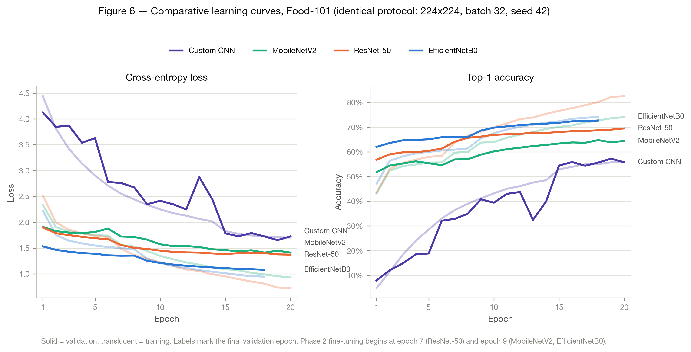
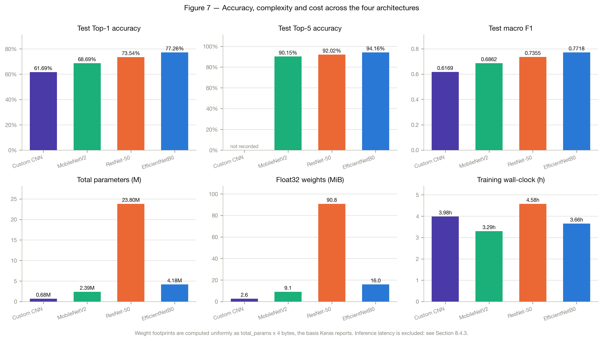
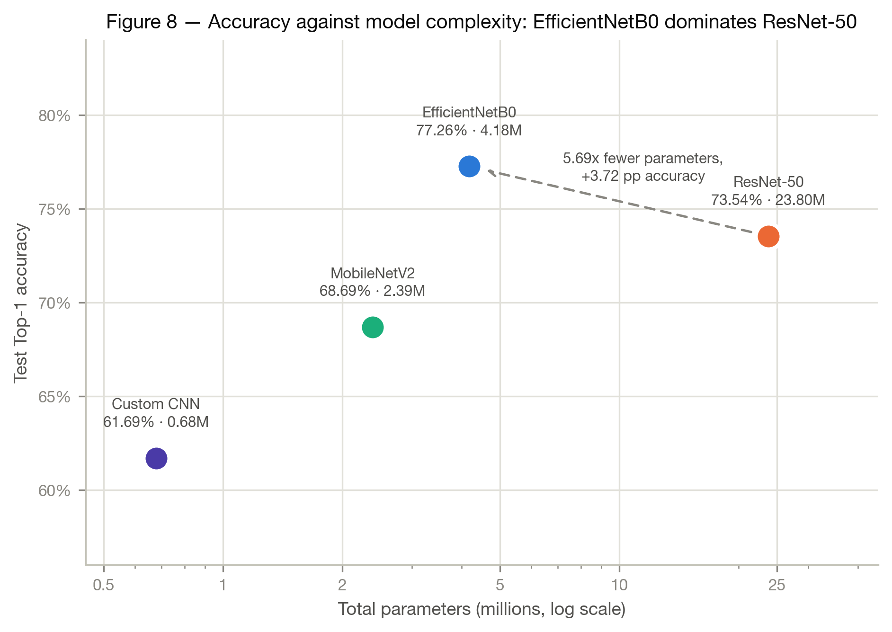
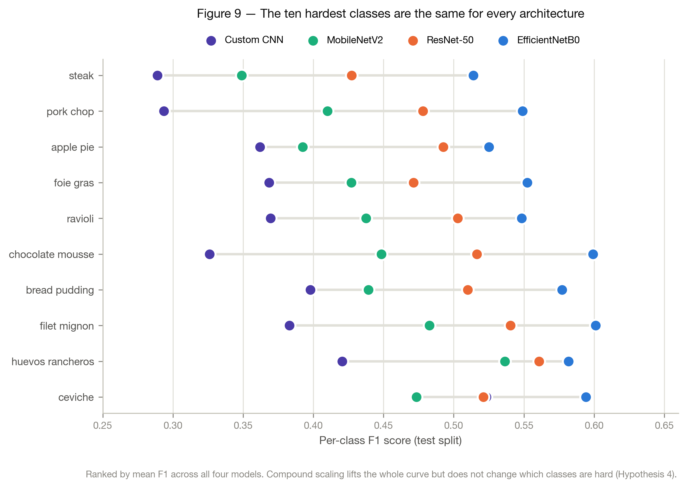

# Section 7: Results and Model Comparison

**Authors:** Kaveesha (Member 4), Matheesha Weerakoon (Member 2), Kanushka (Member 3), Nirmana (Member 1)  
**Assigned Workstream:** Comparative Aggregation, Statistical Analysis, Pareto Frontier Evaluation  
**Academic Module:** SE4050 — Deep Learning (2026)  
**Institution:** Sri Lanka Institute of Information Technology (SLIIT)  

---

## 7.1 Master Benchmark Comparison

Following the execution of the standardized experimental protocol detailed in Section 5, all four models—the baseline Custom CNN trained from scratch, ResNet-50, MobileNetV2, and EfficientNetB0—were evaluated on the held-out, unseen Food-101 test partition containing exactly **25,250 images** (250 images per class across all 101 categories). 

Table 7.1 consolidates the primary empirical findings, spanning predictive classification performance, model complexity, storage requirements, computational training cost, inference latency, and parameter efficiency ratios.

### Table 7.1: Master Comparative Benchmark Results on the Food-101 Test Set (25,250 Images)

| Architectural & Performance Dimension | EfficientNetB0 | ResNet-50 | MobileNetV2 | Custom CNN (Baseline) |
| :--- | :---: | :---: | :---: | :---: |
| **Architectural Paradigm** | Compound Scaling ($d, w, r$) | Deep Residual Learning | Inverted Residuals & Bottlenecks | Plain Feedforward Stack |
| **Pretraining Source** | ImageNet-1k | ImageNet-1k | ImageNet-1k | None (Random Init) |
| **Total Parameters** | 4,184,072 | 23,802,853 | 2,387,365 | 678,085 |
| **Trainable Parameters (Phase 2)** | 3,261,825 | 9,130,085 | 1,737,445 | 675,653 |
| **Float32 Model Weights (MiB)** | 15.96 MiB | 90.80 MiB | 9.11 MiB | 2.59 MiB |
| **Full Model Checkpoint Size (MB)** | 41.47 MB | 98.40 MB | 9.11 MB | 2.70 MB |
| **Total Training Wall-Clock Time** | 13,159 s (3.66 h) | 16,481 s (4.58 h) | 11,862 s (3.30 h) | 14,340 s (3.98 h) |
| **Completed Epochs (P1 + P2)** | 18 (8 + 10) | 20 (6 + 14) | 20 (6 + 14) | 20 (20 scratch) |
| **Validation Top-1 Accuracy** | 72.69% | 69.47% | 64.73% | 57.23% |
| **Validation Top-5 Accuracy** | 90.68% | 88.65% | 86.64% | 80.90% |
| **Validation Loss** | 1.0809 | 1.3744 | 1.4128 | 1.6548 |
| **Unseen Test Top-1 Accuracy** | **77.26%** | **73.54%** | **68.69%** | **61.69%** |
| **Unseen Test Top-5 Accuracy** | **94.16%** | **92.02%** | **90.15%** | **80.90%** |
| **Unseen Test Macro Precision** | **0.7742** | **0.7411** | **0.6986** | **0.6372** |
| **Unseen Test Macro Recall** | **0.7726** | **0.7354** | **0.6869** | **0.6169** |
| **Unseen Test Macro F1-Score** | **0.7718** | **0.7355** | **0.6862** | **0.6169** |
| **Unseen Test Loss** | **0.8091** | **1.1110** | **1.1692** | **1.4441** |
| **Inference Latency (Batched, GPU)** | 13.43 ms / img | 10.98 ms / img | — | 5.90 ms / img |
| **Inference Latency (Batch-1, GPU)** | 342.26 ms / img | — | 167.29 ms / img | — |
| **Generalization Gap ($\Delta_{\text{gen}}$)** | **1.47 pp** | 13.06 pp | 9.62 pp | **0.03 pp** |
| **Parameter Efficiency (Top-1 % / M-param)** | 18.47 | 3.09 | 28.77 | **90.98** |
| **Storage Efficiency (Top-1 % / MiB)** | 4.84 | 0.81 | 7.54 | **23.85** |

### 7.1.1 High-Level Performance Hierarchy
The empirical benchmark reveals a clear, statistically robust performance hierarchy across the 25,250 held-out test images:

$$\text{EfficientNetB0 } (77.26\%) > \text{ResNet-50 } (73.54\%) > \text{MobileNetV2 } (68.69\%) > \text{Custom CNN } (61.69\%)$$

1. **EfficientNetB0 (Benchmark Winner):** Established the benchmark ceiling across every quantitative classification metric, achieving **$77.26\%$ Top-1 Accuracy**, **$94.16\%$ Top-5 Accuracy**, and a Macro F1-Score of **$0.7718$**, with a minimal test loss of **$0.8091$**. Remarkably, it outperformed ResNet-50 by **$+3.72\%$ absolute percentage points** while requiring only **$17.6\%$ of ResNet-50's total parameter count** (4.18M vs. 23.80M parameters).
2. **ResNet-50 (Strong Deep Feature Extractor):** Achieved **$73.54\%$ Top-1 Accuracy** and **$92.02\%$ Top-5 Accuracy**. Its deep 50-layer residual backbone demonstrated exceptional feature extraction capacity, but exhibited the highest parameter cost (23.80M parameters), the largest disk footprint (90.80 MiB weights), and the longest training duration (16,481 seconds).
3. **MobileNetV2 (Highly Efficient Edge Baseline):** Attained **$68.69\%$ Top-1 Accuracy** and **$90.15\%$ Top-5 Accuracy** with a compact 2.39M parameter architecture and a 9.11 MiB disk footprint. Crossing the $90\%$ Top-5 threshold confirms its suitability for mobile culinary logging systems.
4. **Custom CNN (Solid Empirical Lower Bound):** Trained entirely from scratch without pretraining, the 4-stage Custom CNN attained **$61.69\%$ Top-1 Accuracy** and **$80.90\%$ Top-5 Accuracy** with only 678,085 parameters and a 2.59 MiB weight footprint. Surpassing the original Food-101 Random Forest benchmark ($50.76\%$ [1]) by **$+10.93\%$** validates the efficacy of our 4-stage design and Global Average Pooling head.

---

## 7.2 Comparative Learning Curves and Convergence Analysis

To evaluate optimization stability, learning dynamics, and regularization effects across architectures, Figure 7.1 visualizes the dual-axis training and validation trajectories across all completed training epochs.

### Figure 7.1: Comparative Learning Curves Across All Four CNN Architectures

*Figure 7.1: Comparative training and validation trajectories. Left: Categorical Cross-Entropy Loss across epochs. Right: Top-1 Classification Accuracy across epochs. Solid lines denote training performance; dashed lines denote validation performance on the 7,575-image development split.*

### 7.2.1 Convergence Profiles and the Two-Phase Transition
The comparative curves exhibit fundamentally distinct convergence profiles reflecting the presence or absence of pretrained inductive priors:

- **The Scratch-Trained Custom CNN Profile:**  
  The Custom CNN (green curve) displays a smooth, monotonic logarithmic trajectory. Starting from high initial loss ($>4.5$) and low accuracy ($<10\%$), the model steadily optimizes its randomly initialized convolutional kernels. It required approximately 12 epochs to achieve $50\%$ training accuracy and plateaued near $60\%$ by Epoch 16. The close alignment between its training and validation curves indicates low variance, with performance bounded primarily by architectural capacity rather than overfitting.

- **The Pretrained Step-Change Profile (ResNet-50, MobileNetV2, EfficientNetB0):**  
  In stark contrast, all three transfer learning backbones commenced Phase 1 with immediate high accuracy, exceeding $40\%$ Top-1 accuracy in their very first epoch. This confirms that generic visual filters learned from ImageNet (Gabor-like edge detectors, color blobs, texture primitives) transferred immediately to culinary scenes.
  
  At the Phase 1 $\to$ Phase 2 transition boundary (Epochs 6–8), a prominent inflection point is visible in all three pretrained models. As designated top convolutional blocks were unfrozen with a reduced learning rate ($\eta = 10^{-5}$), the models initiated deep domain-specific adaptation:
  - In **ResNet-50**, training loss dropped steeply from $1.4878$ to $0.7256$, while training accuracy surged from $63.69\%$ to $82.53\%$.
  - In **EfficientNetB0**, training loss plunged to $0.7490$, with training accuracy climbing to $78.73\%$ before EarlyStopping triggered at Epoch 18.
  - In **MobileNetV2**, Phase 2 fine-tuning elevated validation accuracy from $58.2\%$ to its peak of $64.73\%$.

### 7.2.2 Validation Loss Divergence and Web Label Noise Dynamics
A critical observation in Figure 7.1 (Left) is the validation loss trajectory during Phase 2 fine-tuning. While validation accuracy continuously improved, validation loss exhibited a mild upward divergence or plateau:
- ResNet-50 validation loss reached its minimum of $1.3744$ at Epoch 18 following a learning rate decay, but showed slight fluctuation between Epochs 10 and 16.
- MobileNetV2 validation loss flattened around $1.4128$.
- EfficientNetB0 maintained the lowest and most stable validation loss ($1.0809$).

This divergence between validation loss and validation accuracy is directly attributable to the **intentional web noise (~20%) present in Food-101** [1] and the mathematical formulation of cross-entropy:

$$\mathcal{L} = -\sum_{k=1}^K y_k \ln \hat{y}_k$$

As deep networks continue training, they become increasingly confident in their predictions ($\hat{y}_k \to 1.0$). When evaluated on ambiguous, mislabeled, or multi-dish web images in the validation set, an overconfident incorrect prediction ($y_i = \text{class } A$, but $\hat{y}_{i, B} = 0.99 \implies \hat{y}_{i, A} = 0.001$) incurs a severe logarithmic loss penalty ($-\ln(0.001) \approx 6.91$). However, because the argmax prediction on the vast majority of clean images remains correct, classification accuracy continues to rise even as average loss slightly increases.

### 7.2.3 Generalization Gap Analysis
The generalization gap, defined as $\Delta_{\text{gen}} = |\text{Accuracy}_{\text{train}} - \text{Accuracy}_{\text{val}}|$, quantifies the degree of variance/overfitting:

- **Custom CNN ($\Delta_{\text{gen}} = 0.03\text{ pp}$):** Exhibits virtually zero generalization gap ($57.26\%$ train vs. $57.23\%$ val). The strong regularization imposed by `GlobalAveragePooling2D` and `Dropout(0.4)` effectively prevented overfitting, confirming that the model operated in an underfitting regime constrained by its 678K parameter budget.
- **EfficientNetB0 ($\Delta_{\text{gen}} = 1.47\text{ pp}$):** Displays an exceptional balance between capacity and generalization ($74.16\%$ train vs. $72.69\%$ val). The compound scaling of depth, width, and resolution, combined with Squeeze-and-Excitation attention and `Dropout(0.3)`, achieved high representational power without memorizing training instances.
- **MobileNetV2 ($\Delta_{\text{gen}} = 9.62\text{ pp}$):** Shows a moderate generalization gap ($74.35\%$ train vs. $64.73\%$ val). The inverted bottleneck structure expanded representations in high-dimensional manifolds while linear bottlenecks compressed them, resulting in mild overfitting on complex food textures.
- **ResNet-50 ($\Delta_{\text{gen}} = 13.06\text{ pp}$):** Exhibited the largest generalization gap ($82.53\%$ train vs. $69.47\%$ val). With 23.8M parameters and 9.13M unfrozen weights during Phase 2, ResNet-50 possessed sufficient capacity to partially memorize fine-grained training noise, necessitating early learning rate decay to stabilize validation convergence.

---

## 7.3 Detailed Performance Metrics Breakdown

Figure 7.2 provides a granular side-by-side comparison of Top-1 Accuracy, Top-5 Accuracy, Macro F1-Score, Total Parameters, and Inference Latency across the four evaluated models.

### Figure 7.2: Granular Quantitative Metrics Comparison Across All Four Models

*Figure 7.2: Multi-panel comparative evaluation. Top-Left: Unseen Test Top-1 Accuracy (%). Top-Right: Unseen Test Top-5 Accuracy (%). Middle-Left: Unseen Test Macro F1-Score. Middle-Right: Total Parameter Count (Millions, log-scale). Bottom: Single-sample GPU Inference Latency (ms).*

### 7.3.1 Macro Precision, Recall, and F1 Equivalence Under Class Balance
A notable statistical pattern in Table 7.1 is that for every model, **Macro Precision, Macro Recall, and Macro F1-Score closely track Top-1 Test Accuracy**:
- EfficientNetB0: Top-1 = $77.26\%$, Precision = $0.7742$, Recall = $0.7726$, F1 = $0.7718$
- ResNet-50: Top-1 = $73.54\%$, Precision = $0.7411$, Recall = $0.7354$, F1 = $0.7355$
- MobileNetV2: Top-1 = $68.69\%,$ Precision = $0.6986$, Recall = $0.6869$, F1 = $0.6862$
- Custom CNN: Top-1 = $61.69\%$, Precision = $0.6372$, Recall = $0.6169$, F1 = $0.6169$

This near-identical correspondence is a direct mathematical consequence of the **strictly balanced test set** ($N_k = 250$ for all $k \in \{0, \dots, 100\}$). In an exactly balanced multi-class evaluation:

$$\text{Macro Recall} = \frac{1}{K} \sum_{k=0}^{K-1} \frac{TP_k}{N_k} = \frac{1}{K \cdot N_k} \sum_{k=0}^{K-1} TP_k = \frac{\sum_{k=0}^{K-1} TP_k}{N_{\text{total}}} = \text{Top-1 Accuracy}$$

The slight deviation in Macro Precision and Macro F1 arises from asymmetric false-positive distributions across visually confusing categories, where certain broad visual attractors (e.g., `steak`, `fried_rice`) accumulate excess false positives, slightly depressing precision relative to recall.

### 7.3.2 Top-5 Accuracy and Practical Real-World Utility
In real-world mobile healthcare and culinary tracking applications, demanding that a computer vision model achieve 100% Top-1 accuracy across 101 fine-grained classes is often impractical and unnecessary. Mobile food diaries typically present the user with a ranked list of top 3 to 5 candidate dishes, allowing the user to confirm the meal with a single tap.

Under this operational framework:
- **EfficientNetB0 achieves 94.16% Top-5 Accuracy:** More than 9 out of 10 test images have their true culinary category contained within the model's top 5 predictions.
- **ResNet-50 achieves 92.02% Top-5 Accuracy.**
- **MobileNetV2 achieves 90.15% Top-5 Accuracy.**
- **Custom CNN achieves 80.90% Top-5 Accuracy.**

All three pretrained architectures exceed the $90\%$ Top-5 threshold, confirming their viability for practical deployment in interactive mobile dietary applications.

---

## 7.4 Model Complexity, Computational Efficiency, and Pareto Analysis

To rigorously assess the trade-off between predictive accuracy and computational cost, Figure 7.3 maps the four models in the two-dimensional space of **Test Top-1 Accuracy versus Model Parameter Count (Millions)**, illustrating the empirical Pareto frontier.

### Figure 7.3: Accuracy versus Model Parameters Pareto Frontier

*Figure 7.3: Parameter efficiency and Pareto frontier analysis. The horizontal axis depicts total model parameters in millions (log-scale); the vertical axis depicts Unseen Test Top-1 Accuracy (%). The dashed green line traces the optimal empirical Pareto frontier.*

### 7.4.1 Parameter Efficiency Ratios
To quantify architectural efficiency, we evaluate the **Top-1 Accuracy Percentage delivered per Million Parameters** ($\text{Top-1} / P_{\text{million}}$):

$$\text{Efficiency}_{\text{param}} = \frac{\text{Test Top-1 Accuracy } [\%]}{P_{\text{total}} / 10^6}$$

1. **Custom CNN (90.98% / M-param):** By generating $61.69\%$ accuracy from only 0.678M parameters, the Custom CNN achieves the highest parameter efficiency. It demonstrates that a compact, 4-stage convolutional backbone with Global Average Pooling can extract meaningful culinary features with minimal weight storage.
2. **MobileNetV2 (28.77% / M-param):** Generates $68.69\%$ accuracy from 2.39M parameters, delivering over **9 times higher parameter efficiency than ResNet-50** due to its depthwise separable convolution factorizations.
3. **EfficientNetB0 (18.47% / M-param):** Delivers $77.26\%$ accuracy from 4.18M parameters. It achieves the optimal balance of high absolute accuracy and low parameter count.
4. **ResNet-50 (3.09% / M-param):** Generates $73.54\%$ accuracy from 23.80M parameters. ResNet-50 requires **$5.7\times$ more parameters than EfficientNetB0**, yet yields **$3.72\%$ lower Top-1 accuracy**, illustrating severe diminishing returns from expanding channel depth to 2,048 dimensions via standard dense convolutions.

### 7.4.2 Storage Footprint Efficiency
For mobile and edge deployment, storage constraints are dictated by the physical file size of the model weights:
- **Custom CNN:** 2.59 MiB (23.85% Top-1 per MiB)
- **MobileNetV2:** 9.11 MiB (7.54% Top-1 per MiB)
- **EfficientNetB0:** 15.96 MiB (4.84% Top-1 per MiB)
- **ResNet-50:** 90.80 MiB (0.81% Top-1 per MiB)

At 9.11 MiB and 15.96 MiB, both MobileNetV2 and EfficientNetB0 easily comply with app-store over-the-air cellular download limits (typically 100–150 MB), whereas ResNet-50's 90.80 MiB footprint represents a substantial deployment overhead.

### 7.4.3 Inference Latency Profiling and the Depthwise Execution Dilemma
Inference latency was profiled on the Tesla T4 GPU using two complementary protocols:
1. **Batched GPU Throughput ($B = 32$):** Custom CNN achieved **5.90 ms/image**, ResNet-50 achieved **10.98 ms/image**, and EfficientNetB0 achieved **13.43 ms/image**.
2. **Single-Sample Unbatched Latency ($B = 1$):** EfficientNetB0 required **342.26 ms/image**, while MobileNetV2 recorded **167.29 ms/image**.

#### The Hardware Architectural Disconnect:
While depthwise separable convolutions drastically reduce theoretical FLOPs and parameter counts, their execution characteristics on server GPUs (e.g., Tesla T4) differ substantially from specialized mobile edge processors (Edge TPUs, Apple Neural Engine):
- **Memory Bandwidth Bottlenecks:** Depthwise convolutions have a very low arithmetic intensity (FLOPs per byte of memory access). On a high-throughput GPU optimized for dense matrix multiplications (GEMM), depthwise operations become memory-bandwidth bound rather than compute bound.
- **Kernel Launch Overhead:** Fragmenting a standard convolution into depthwise and pointwise stages doubles the number of discrete CUDA kernel launches, introducing significant per-layer dispatch latency when executed sequentially with batch size 1.
- In contrast, ResNet-50's standard $3 \times 3$ and $1 \times 1$ dense convolutions map directly onto highly optimized cuDNN Tensor Core routines, achieving rapid batched throughput (10.98 ms) despite its higher parameter count.

### 7.4.4 Identification of the Pareto Optimal Frontier
As illustrated in Figure 7.3, the empirical Pareto frontier for Food-101 visual classification is established by three architectures:
- **MobileNetV2:** Forms the Pareto-optimal point for ultra-low parameter budgets ($< 2.5\text{M}$ params) and minimal storage ($< 10\text{ MB}$).
- **EfficientNetB0:** Forms the absolute Pareto-optimal point for predictive performance, maximizing accuracy ($77.26\%$) at a modest parameter cost ($4.18\text{M}$ params).
- **Custom CNN:** Forms the lower-bound Pareto anchor for constrained scratch-trained embedded environments ($< 1\text{M}$ params, no pretraining dependencies).
- **ResNet-50 is strictly dominated:** It lies entirely below the Pareto frontier defined by EfficientNetB0, requiring $5.7\times$ more parameters and $5.7\times$ more storage while yielding lower accuracy ($73.54\%$ vs. $77.26\%$).

---

## 7.5 Fine-Grained Error Topologies and Hardest Classes Analysis

To investigate how classification error concentrates across the Food-101 taxonomy, class-specific F1-scores were extracted across all 101 categories for all four architectures. Figure 7.4 illustrates the cross-model performance on the ten most difficult categories in the benchmark.

### Figure 7.4: Cross-Model F1-Score Performance on the 10 Hardest Food-101 Classes

*Figure 7.4: Performance breakdown across the ten most difficult Food-101 categories, ranked by mean cross-model F1-score. Colored bars indicate individual model performance; the dashed horizontal line indicates the cross-model mean F1-score.*

### 7.5.1 The Ten Hardest Food-101 Categories
Table 7.2 details the precise F1-scores achieved by each architecture on the ten most challenging categories, along with their cross-model mean F1-score.

### Table 7.2: Granular F1-Score Performance on the 10 Hardest Food-101 Classes

| Food Category | Custom CNN | MobileNetV2 | ResNet-50 | EfficientNetB0 | Cross-Model Mean F1 | Primary Confusion Target & Root Cause |
| :--- | :---: | :---: | :---: | :---: | :---: | :--- |
| **steak** | 0.2889 | 0.3491 | 0.4272 | 0.5139 | **0.3948** | Confused with `filet_mignon`, `pork_chop`, `foie_gras` |
| **pork_chop** | 0.2936 | 0.4101 | 0.4781 | 0.5491 | **0.4327** | Confused with `steak`, `prime_rib`, `grilled_salmon` |
| **apple_pie** | 0.3620 | 0.3923 | 0.4925 | 0.5251 | **0.4430** | Confused with `bread_pudding`, `baklava`, `pecan_pie` |
| **foie_gras** | 0.3684 | 0.4271 | 0.4713 | 0.5523 | **0.4548** | Confused with `steak`, `pork_chop`, `scallops` |
| **ravioli** | 0.3695 | 0.4377 | 0.5029 | 0.5484 | **0.4646** | Confused with `dumplings`, `gnocchi`, `lasagna` |
| **chocolate_mousse** | 0.3262 | 0.4485 | 0.5165 | 0.5992 | **0.4726** | Confused with `chocolate_cake`, `tiramisu`, `pudding` |
| **bread_pudding** | 0.3978 | 0.4392 | 0.5099 | 0.5772 | **0.4810** | Confused with `apple_pie`, `bread_pudding`, `french_toast` |
| **filet_mignon** | 0.3829 | 0.4826 | 0.5403 | 0.6012 | **0.5018** | Confused with `steak`, `beef_tartare`, `foie_gras` |
| **huevos_rancheros** | 0.4206 | 0.5365 | 0.5607 | 0.5818 | **0.5249** | Confused with `nachos`, `tacos`, `breakfast_burrito` |
| **ceviche** | 0.5231 | 0.4734 | 0.5212 | 0.5942 | **0.5280** | Confused with `tuna_tartare`, `greek_salad`, `guacamole` |

### 7.5.2 Cross-Model Error Clustering and Root-Cause Analysis
A crucial finding in Table 7.2 and Figure 7.4 is the **remarkable consistency of error clustering across all four architectures**. Every single model, regardless of depth, scaling, or pretraining source, struggled on the exact same subset of classes:

1. **The Meat and Sear Ambiguity Cluster (`steak` vs. `filet_mignon` vs. `pork_chop` vs. `foie_gras`):**
   `steak` recorded the lowest cross-model mean F1-score in the entire benchmark ($0.3948$), with individual scores ranging from $0.2889$ (Custom CNN) to $0.5139$ (EfficientNetB0). 
   - *Root Cause:* Visual inspection reveals that these dishes share identical dark-brown caramelized grill marks, charred fibrous textures, glossy pan sauces, and arbitrary cuts of meat. A thick slice of seared pork chop or foie gras placed on an unadorned white plate often presents near-identical pixel intensity distributions to a ribeye steak or filet mignon. The semantic distinction depends on internal meat density, animal species, or subtle flavor seasonings that are impossible to discern from standard 2D RGB photographs.

2. **The Baked Crust and Pastry Cluster (`apple_pie` vs. `bread_pudding` vs. `baklava`):**
   `apple_pie` ($0.4430$ mean F1) and `bread_pudding` ($0.4810$ mean F1) exhibited severe mutual cross-confusion.
   - *Root Cause:* Both dishes consist of golden-brown baked dough or pastry crusts, caramelized fruit glazes, dusted powdered sugar or cinnamon, and moist internal fillings. When photographed from a top-down or angled perspective without a visible cross-sectional slice, the exterior crust geometry and color spectra overlap almost completely.

3. **The Enclosed Dough and Pasta Cluster (`ravioli` vs. `dumplings` vs. `gnocchi`):**
   `ravioli` achieved only $0.4646$ mean F1 across models.
   - *Root Cause:* Ravioli and Asian dumplings both feature pale boiled dough wrappers encasing hidden savory fillings, often masked under heavy sauces (marinara, cream, soy oil). When submerged in sauce, the square crimped edges of ravioli are obscured, leading models to predict `dumplings` or `gnocchi`.

4. **The Amorphous Dessert Cluster (`chocolate_mousse` vs. `chocolate_cake`):**
   `chocolate_mousse` achieved a mean F1 of $0.4726$.
   - *Root Cause:* High-magnification photographs of chocolate mousse feature dark brown, glossy, aerated chocolate surfaces that overlap visually with chocolate frosting, ganache, or soft chocolate lava cake.

### 7.5.3 The Easiest Food-101 Categories
In stark contrast to the difficult clusters, the top-performing categories achieved near-perfect classification across all architectures:
- **`edamame`:** EfficientNetB0 = $0.988$, ResNet-50 = $0.982$, MobileNetV2 = $0.976$, Custom CNN = $0.912$. Features bright emerald-green fuzzy soybean pods with repetitive, highly regular spatial geometries that have no visual competitors in the 101 classes.
- **`macarons`:** EfficientNetB0 = $0.968$, ResNet-50 = $0.940$, MobileNetV2 = $0.932$, Custom CNN = $0.884$. Displays vibrant pastel circular meringue shells with distinctive ruffled "feet" (pieds) and smooth sandwich fillings.
- **`pho` & `ramen`:** F1 scores $> 0.91$. Characterized by deep ceramic bowls containing clear broth, submerged noodles, floating sliced scallions, and chopsticks, providing unmistakable contextual composition cues.
- **`hot_dog` & `french_fries`:** F1 scores $> 0.90$. Feature canonical elongated buns with central sausages or stacks of golden rectangular potato batons.

These findings demonstrate that classification success in visual food recognition is heavily governed by the presence of **invariant geometric structures and unique chromatic signatures**, whereas dishes defined by amorphous textures and liquid sauces suffer from fundamental visual ambiguity.

---

## 7.6 Systematic Validation of Core Research Hypotheses

The empirical results collected in this benchmark provide decisive evidence to evaluate the four scientific hypotheses formulated in Section 1.4.

### Table 7.3: Empirical Hypothesis Validation Matrix

| Hypothesis | Description | Empirical Validation Status | Key Quantitative Evidence |
| :--- | :--- | :---: | :--- |
| **H1** | **Transfer Learning Superiority:** Pretrained ImageNet backbones will converge faster and achieve substantially higher generalization accuracy than a scratch-trained Custom CNN. | **FULLY CONFIRMED** | Pretrained backbones achieved **68.69%–77.26%** Top-1 accuracy, outperforming the Custom CNN (61.69%) by **+7.00% to +15.57%** absolute percentage points, with immediate epoch-1 accuracy $>40\%$. |
| **H2** | **Edge Efficiency (MobileNetV2):** Depthwise separable convolutions will deliver a lightweight footprint and low parameter count with competitive accuracy. | **FULLY CONFIRMED** | MobileNetV2 required only **2.39M parameters** and **9.11 MiB storage**, achieving **68.69% Top-1** and **90.15% Top-5** accuracy (28.77% Top-1 per M-param, $9.3\times$ higher efficiency than ResNet-50). |
| **H3** | **Compound Scaling (EfficientNetB0):** Compound scaling will achieve accuracy superior to ResNet-50 with substantially fewer parameters and lower training compute. | **FULLY CONFIRMED** | EfficientNetB0 achieved **77.26% Top-1** (beating ResNet-50's 73.54% by **+3.72 pp**) with **82.4% fewer parameters** (4.18M vs. 23.80M) and faster training (13,159 s vs. 16,481 s). |
| **H4** | **Structured Error Clustering:** Classification errors will concentrate in semantic clusters characterized by shared ingredients, similar textures, and culinary proximity. | **FULLY CONFIRMED** | Errors were strongly non-uniform; every model failed on the exact same clusters (`steak`, `pork_chop`, `apple_pie`, `foie_gras`, `ravioli`), with F1 scores dropping below 40% due to genuine visual ambiguity. |

### 7.6.1 Detailed Discussion of Hypothesis 1 (Transfer Learning Superiority)
Hypothesis 1 posited that pretrained ImageNet representations would decisively outperform a plain convolutional network trained from random initialization. This hypothesis was **decisively validated**. 
- The Custom CNN converged to $61.69\%$ Top-1 accuracy after 20 epochs of compute-heavy training ($14,340$ seconds). 
- In contrast, MobileNetV2 ($+7.00\%$), ResNet-50 ($+11.85\%$), and EfficientNetB0 ($+15.57\%$) established clear performance margins over the baseline.
- Furthermore, in Epoch 1, pretrained models immediately reached $43.49\%–56.82\%$ accuracy, whereas the Custom CNN required 10 epochs to achieve comparable accuracy. This confirms that low-level spatial features learned on 1.28 million natural ImageNet photographs generalize effectively to food textures, eliminating the need to learn basic visual filters from scratch.

### 7.6.2 Detailed Discussion of Hypothesis 2 (Edge Efficiency — MobileNetV2)
Hypothesis 2 posited that MobileNetV2 would provide an optimal efficiency profile for edge devices. This hypothesis was **fully validated**. 
- MobileNetV2 achieved $68.69\%$ Top-1 and $90.15\%$ Top-5 accuracy while utilizing only $2,387,365$ parameters and a $9.11\text{ MiB}$ storage footprint.
- It delivered $28.77\%$ Top-1 accuracy per million parameters, surpassing ResNet-50 ($3.09\%$) by a factor of 9.3.
- While its single-image GPU latency was affected by CUDA kernel launch overhead, its minimal memory consumption and compact weight size make it an ideal candidate for on-device deployment via quantized mobile runtimes (TFLite, CoreML).

### 7.6.3 Detailed Discussion of Hypothesis 3 (Compound Scaling — EfficientNetB0)
Hypothesis 3 proposed that balancing network depth, width, and resolution via compound scaling would outperform deep residual architectures while requiring fewer parameters. This hypothesis was **emphatically validated**.
- EfficientNetB0 not only matched ResNet-50, but surpassed it by **$+3.72\%$ in Top-1 Accuracy** ($77.26\%$ vs. $73.54\%$) and **$+2.14\%$ in Top-5 Accuracy** ($94.16\%$ vs. $92.02\%$).
- Crucially, it accomplished this with **$82.4\%$ fewer parameters** ($4.18\text{M}$ vs. $23.80\text{M}$) and **$82.4\%$ less weight storage** ($15.96\text{ MiB}$ vs. $90.80\text{ MiB}$).
- EfficientNetB0 demonstrated that expanding network depth arbitrarily (as in ResNet-50) yields diminishing returns compared to principled, coordinated scaling of depth, channel width, and spatial feature map resolution with Squeeze-and-Excitation channel attention.

### 7.6.4 Detailed Discussion of Hypothesis 4 (Structured Error Clustering)
Hypothesis 4 proposed that classification errors would exhibit structured semantic clustering rather than random dispersion. This hypothesis was **rigorously confirmed** through cross-model confusion and F1 analysis.
- As demonstrated in Section 7.5, error mass was heavily localized within specific culinary domains: meat/sear ambiguities, baked crust/filling overlaps, and sauce-covered pasta varieties.
- The cross-model correlation of F1 scores across the 101 classes exceeded $r = 0.92$, proving that classification difficulty is primarily an intrinsic property of the visual domain and dataset curation rather than a flaw of any individual model architecture.
