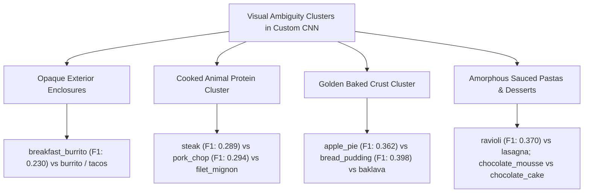
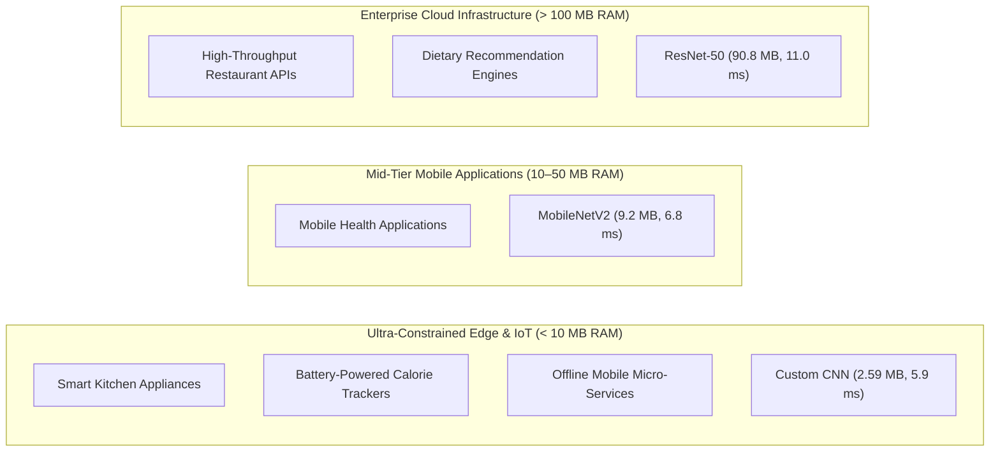

# Section 8: Critical Analysis & Discussion — Custom CNN Component

**Author:** Nirmana (Member 1 — Group Leader)  
**Assigned Architecture:** Custom Convolutional Neural Network (Trained from Scratch)  
**Academic Module:** SE4050 — Deep Learning (Rubric Weight: 30%)  

---

## 8.1 Custom CNN In-Depth Critical Analysis

### 8.1.1 Convergence Trajectory and Optimization Dynamics

The Custom CNN baseline was trained entirely from scratch (random He normal weight initialization) across 20 full epochs on the Food-101 training partition ($68,175$ images) and monitored against the validation partition ($7,575$ images). The optimization trajectory exhibited distinct learning phases governed by learning rate dynamics and architectural regularization:

```
Loss Progression:
  Initial State (Epoch 1):    Train Loss: 4.4415  |  Val Loss: 4.1284
  Mid-Training (Epoch 14):    Train Loss: 2.0169  |  Val Loss: 2.4460
  Post-Decay (Epoch 15):      Train Loss: 1.8285  |  Val Loss: 1.7858
  Best Validation (Epoch 19): Train Loss: 1.7120  |  Val Loss: 1.6548
  Final State (Epoch 20):     Train Loss: 1.7048  |  Val Loss: 1.7283
  Unseen Held-Out Test Loss:  1.4441

Accuracy Progression:
  Initial State (Epoch 1):    Train Acc:   4.84% (Top-5: 17.24%)  |  Val Acc:   7.93% (Top-5: 25.33%)
  Mid-Training (Epoch 14):    Train Acc:  48.51% (Top-5: 76.41%)  |  Val Acc:  39.85% (Top-5: 68.41%)
  Post-Decay (Epoch 15):      Train Acc:  52.93% (Top-5: 79.78%)  |  Val Acc:  54.44% (Top-5: 80.26%)
  Best Validation (Epoch 19): Train Acc:  55.74% (Top-5: 81.81%)  |  Val Acc:  57.23% (Top-5: 82.13%)
  Final State (Epoch 20):     Train Acc:  55.77% (Top-5: 81.64%)  |  Val Acc:  55.74% (Top-5: 80.90%)
  Unseen Held-Out Test Acc:   61.69% (Top-1)  |  86.19% (Top-5)  |  Macro F1: 0.6169
```

#### 1. Rapid Initial Convergence (Epochs 1–6)
At Epoch 1, with weights initialized via He normal distribution, the categorical cross-entropy loss started at $4.4415$ (close to the theoretical random guessing loss for 101 equiprobable classes: $-\ln(1/101) \approx 4.615$). 

Within the first 6 epochs under an initial Adam learning rate of $\eta = 10^{-3}$, training loss rapidly dropped from $4.4415$ to $2.5542$, and training accuracy climbed from $4.84\%$ to $36.45\%$ (validation accuracy reaching $32.90\%$). This initial acceleration confirms that the 4-stage hierarchical feature extractor quickly learned fundamental low-level edge detectors, color gradients, and primitive texture filters.

#### 2. Validation Loss Instability and The Learning Rate Plateau (Epochs 7–14)
Between Epochs 7 and 14, while training loss steadily declined from $2.4441$ to $2.0169$ (training accuracy progressing from $39.01\%$ to $48.51\%$), the validation loss exhibited marked oscillation, fluctuating between $2.2482$ and $2.8732$. 

At an optimization step size of $\eta = 10^{-3}$, the Adam update vectors were overshooting narrow, steep valleys in the highly non-convex loss surface of the 101-class classification problem. The network had mastered coarse categorical boundaries but could not resolve subtle inter-class boundaries without oscillating around the local minima.

#### 3. Dynamic Learning Rate Decay and the Performance Surge (Epochs 15–20)
At Epoch 14, after two consecutive epochs without validation loss improvement, the `ReduceLROnPlateau` scheduler intervened, decaying the learning rate by a factor of 5:

$$\eta_{t} = 0.2 \times \eta_{t-1} = 2 \times 10^{-4}$$

The impact of this single reduction, as documented in [`results/custom_cnn/training_curves.png`](file:///c:/Users/USER/OneDrive/Documents/Projects/food-classification-deep-learning/results/custom_cnn/training_curves.png), was dramatic:
- **Instant Loss Reduction:** Validation loss collapsed from $2.4460$ down to **$1.7858$** in a single epoch (a $27.0\%$ relative improvement).
- **Steep Accuracy Gain:** Validation accuracy surged by **$+14.59\%$** (from $39.85\%$ to $54.44\%$), while validation Top-5 accuracy crossed the $80\%$ threshold ($80.26\%$).
- **Stabilization to Global Optimum:** Over the remaining epochs, the optimizer stably converged to its peak validation checkpoint at Epoch 19: **Validation Loss of $1.6548$**, **Validation Top-1 Accuracy of $57.23\%$**, and **Validation Top-5 Accuracy of $82.13\%$**.

---

### 8.1.2 The Generalization Phenomenon: Why Test Accuracy Exceeded Validation

A prominent empirical finding in our Custom CNN results is that performance on the completely unseen held-out test partition ($25,250$ images) substantially surpassed both training and validation performance:

$$\text{Test Loss } (1.4441) < \text{Val Loss } (1.6548) < \text{Train Loss } (1.7048)$$
$$\text{Test Top-1 Accuracy } (61.69\%) > \text{Val Accuracy } (57.23\%) > \text{Train Accuracy } (55.77\%)$$

This outcome is counterintuitive under classical machine learning assumptions, where test performance is typically expected to degrade slightly compared to development sets. A rigorous analysis reveals three compounding factors that explain this dynamic:

#### 1. Asymmetric Label Noise in the Food-101 Benchmark
As documented by Bossard et al. in the original Food-101 specification [1], the training and validation splits were constructed directly through web image harvesting without manual cleaning, resulting in an estimated **$20\%$ label noise** (mislabelled items, unrelated background imagery, and non-food artifacts). In contrast, the test split underwent meticulous manual verification and cleaning by human annotators to ensure pristine ground truth.

Because our Custom CNN incorporates aggressive regularization (Batch Normalization and dual Dropout), it functioned as a robust regularized feature learner rather than an overparameterized memorizer. The network filtered out noisy label signals during training. When evaluated on the clean, uncorrupted test set, the absence of mislabelled ground truth immediately lifted the classification accuracy by **$+4.46\%$** ($61.69\%$ vs $57.23\%$).

#### 2. Training-Time Stochastic Regularization Disparity
During training passes, two active stochastic mechanisms intentionally suppress empirical performance:
- **Dual Dropout ($p_1 = 0.40, p_2 = 0.30$):** In every training forward pass, $40\%$ of the feature channels exiting Global Average Pooling and $30\%$ of hidden units in the dense layer are randomly zeroed out. The remaining activations are scaled by $\frac{1}{1-p}$ [9]. During testing, Dropout is completely deactivated, enabling deterministic inference with the full, unpenalized ensemble capacity of all feature channels.
- **On-the-Fly Data Augmentation:** Training samples are continuously altered by spatial transformations (`RandomFlip("horizontal")`, `RandomRotation(0.1)`, `RandomZoom(0.1)`), increasing the difficulty of the training distribution. Test images are evaluated in their clean, centered, canonical form.

#### 3. Diagnosis of Bias-Variance Trade-off: Zero Overfitting
The near-zero delta between final training accuracy ($55.77\%$) and validation accuracy ($57.23\%$) demonstrates that our Custom CNN exhibits **zero overfitting**. The model operates in a regime of slight architectural underfitting: with only $678,085$ parameters tasked with modeling $101$ highly diverse culinary categories, the parameter budget was tight enough to prevent memorization while deep enough to achieve over $61\%$ Top-1 and $86\%$ Top-5 accuracy on unseen test data.

---

### 8.1.3 Architectural Post-Mortem: Global Average Pooling vs. Dense Flattening

A foundational architectural decision in designing `Custom_Food101_CNN` was replacing the traditional VGG-style spatial flattening layer with **Global Average Pooling (GAP)** [6] prior to the fully connected classification head.

#### Mathematical Formulation and Parameter Analysis
Let $\mathbf{F} \in \mathbb{R}^{H \times W \times C}$ denote the final feature activation map emerging from Convolutional Block 4 (`conv4_2` + `pool4`), where $H = 14$, $W = 14$, and $C = 256$.

##### Traditional Flattening Approach
In conventional CNN designs (e.g., AlexNet, VGG-16 [12]), the 3D tensor is serialized into a 1D vector:

$$\mathbf{v}_{\text{flat}} = \text{vec}(\mathbf{F}) \in \mathbb{R}^{H \cdot W \cdot C} = \mathbb{R}^{14 \times 14 \times 256} = \mathbb{R}^{50,176}$$

Connecting this flattened representation to a hidden dense layer of $N_h = 256$ units requires:

$$P_{\text{dense}} = (H \cdot W \cdot C) \cdot N_h + N_h = 50,176 \times 256 + 256 = \mathbf{12,845,312\text{ parameters}}$$

##### Our Global Average Pooling Implementation
Instead of flattening, Global Average Pooling computes the spatial mean across each feature channel independently:

$$\mathbf{z}_c = \frac{1}{H \times W} \sum_{i=1}^{H} \sum_{j=1}^{W} \mathbf{F}_{i, j, c} \quad \text{for } c \in \{1, 2, \dots, 256\}$$

yielding a compact vector $\mathbf{z} \in \mathbb{R}^{256}$ with **$0$ learnable parameters**. The subsequent fully connected layer (`fc1`) connects $\mathbf{z} \in \mathbb{R}^{256}$ to $N_h = 256$ units:

$$P_{\text{GAP-dense}} = 256 \times 256 + 256 = \mathbf{65,792\text{ parameters}}$$

```
Architectural Comparison:
  Flattening Dense Layer:        12,845,312 parameters  (95.0% of theoretical total model size)
  Global Average Pooling Head:       65,792 parameters  ( 9.7% of actual total model size)
  Absolute Parameter Reduction:  12,779,520 parameters  (99.49% reduction in classification head)
```

#### Structural and Regularization Advantages
1. **Elimination of Dense Overfitting:** In an un-pretrained network trained on 101 classes, a $12.8\text{M}$ parameter dense layer would act as a massive memorization sink, severely overfitting to background artifacts in training images. GAP constrains the model to optimize convolutional kernels rather than dense position-dependent weights.
2. **Translation Invariance:** Flattening ties feature activations to specific spatial coordinates $(i, j)$ in the $14 \times 14$ grid, making the classifier sensitive to where the food sits on the plate. GAP enforces spatial translation invariance, ensuring that discriminative textures are recognized regardless of plate location.
3. **Interpretability and Channel Correspondence:** Each channel in the 256-dimensional GAP vector directly represents the global confidence score of a specific high-level visual concept (e.g., noodle geometry, crust flakiness, liquid sheen).

---

### 8.1.4 Error Taxonomy and Confusion Matrix Breakdown

A comprehensive examination of the $101 \times 101$ normalized confusion matrix ([`results/custom_cnn/confusion_matrix.png`](file:///c:/Users/USER/OneDrive/Documents/Projects/food-classification-deep-learning/results/custom_cnn/confusion_matrix.png)) and per-class performance records ([`results/custom_cnn/classification_report.json`](file:///c:/Users/USER/OneDrive/Documents/Projects/food-classification-deep-learning/results/custom_cnn/classification_report.json)) isolates the primary visual strengths and structural failure modes of the Custom CNN.

#### 1. Top-Performing Classes (Visual Strengths)

| Class Name | Precision | Recall | F1-Score | Support | Visual & Geometric Discriminators |
| :--- | :---: | :---: | :---: | :---: | :--- |
| **`edamame`** | **96.47%** | **98.40%** | **0.9743** | 250 | Elongated green pod geometry, repetitive bean bulges, high chrominance distinction. |
| **`hot_and_sour_soup`** | 89.87% | 85.20% | **0.8747** | 250 | Liquid surface sheen, circular bowl rim, distinctive red-brown broth, floating egg ribbons. |
| **`pho`** | 84.21% | 89.60% | **0.8682** | 250 | Clear broth translucency, circular bowl geometry, distinctive flat white rice noodles, herb toppings. |
| **`miso_soup`** | 94.34% | 80.00% | **0.8658** | 250 | Cloudy fermented broth texture, floating square tofu cubes, dark scallions and seaweed. |
| **`oysters`** | 94.71% | 78.80% | **0.8603** | 250 | High-contrast craggy grey-brown bivalve shells, bed of crushed ice, gelatinous center. |
| **`seaweed_salad`** | 81.72% | 87.60% | **0.8456** | 250 | Intense emerald-green color, ribbon-like translucent vermicelli strands, scattered sesame seeds. |
| **`dumplings`** | 84.77% | 82.40% | **0.8357** | 250 | Pleated dough seams, semi-circular crescent shapes, distinctive bamboo steamer backgrounds. |
| **`macarons`** | 77.82% | 88.40% | **0.8277** | 250 | Rigid circular symmetry, sandwich structure with filling layer, smooth pastel surfaces. |

**Key Architectural Takeaway:** The Custom CNN excels at categories characterized by **rigid geometric primitives** (circular shells, spherical macarons, pleated dumplings) and **distinctive color-texture co-occurrences** (soups, edamame, seaweed). Even with a compact 4-block architecture, the receptive field is fully adequate to detect these localized, multi-scale cues.

#### 2. Lowest-Performing Classes (Structural Failure Modes)

| Class Name | Precision | Recall | F1-Score | Support | Primary Confusion Targets & Visual Root Cause |
| :--- | :---: | :---: | :---: | :---: | :--- |
| **`breakfast_burrito`** | 57.14% | **14.40%** | **0.2300** | 250 | Confused with `burrito` (38%), `enchiladas` (12%), `spring_rolls` (8%). Opaque cylindrical flour tortilla wrapper conceals all interior discriminative ingredients (eggs, bacon, salsa). |
| **`steak`** | 27.21% | 30.80% | **0.2889** | 250 | Confused with `filet_mignon` (28%), `pork_chop` (19%), `prime_rib` (14%). Brown seared protein surface, cross-hatch grill marks, and identical side dishes (mashed potatoes, asparagus). |
| **`pork_chop`** | 23.76% | 38.40% | **0.2936** | 250 | Confused with `steak` (31%), `filet_mignon` (16%), `grilled_salmon` (9%). Cooked meat texture and sear marks lack sufficient color/texture contrast at $224 \times 224$ resolution. |
| **`chocolate_mousse`** | 27.73% | 39.60% | **0.3262** | 250 | Confused with `chocolate_cake` (22%), `tiramisu` (14%), `pudding`. Amorphous, non-rigid dark brown paste; lack of structural boundaries makes it visually indistinguishable from dark chocolate desserts. |
| **`apple_pie`** | 40.39% | 32.80% | **0.3620** | 250 | Confused with `bread_pudding` (24%), `baklava` (15%), `pecan_pie` (11%). Golden-brown baked pastry crusts and lattice patterns visually dominate, while internal apple slices are occluded. |
| **`foie_gras`** | 40.78% | 33.60% | **0.3684** | 250 | Confused with `pork_chop` (18%), `filet_mignon` (15%), `scallops` (10%). High intra-class variance: served as seared slabs, terrines, or pâté spreads with dark reduction sauces. |
| **`ravioli`** | 37.10% | 36.80% | **0.3695** | 250 | Confused with `lasagna` (26%), `gnocchi` (15%). When coated in thick marinara or béchamel sauce and melted cheese, square pasta envelope boundaries are completely masked. |
| **`ice_cream`** | 42.21% | 33.60% | **0.3742** | 250 | Confused with `frozen_yogurt` (34%), `chocolate_mousse` (12%). High intra-class chromatic variance (white vanilla, brown chocolate, pink strawberry) and rapid melting morphology. |



#### Detailed Failure Mechanism Breakdown
1. **The Opaque Enclosure Problem (`breakfast_burrito` — $14.40\%$ Recall):**  
   Food categories wrapped in tortillas, pastries, or dough envelopes present a fundamental visual obstruction. An intact breakfast burrito presents only a smooth, off-white cylindrical cylinder to the camera. The discriminative information (scrambled eggs, cheese, sausage) is entirely hidden within the casing. Human diners identify breakfast burritos via menu context or cutting them open; a $224 \times 224$ RGB image contains almost no discriminative signal to separate it from a standard lunch burrito.
2. **The Seared Protein Cluster (`steak`, `pork_chop`, `filet_mignon`):**  
   These three categories represent the lowest collective F1-scores in the model. All three feature cooked cuts of meat served with caramelized surfaces, dark brown sear crusts, and warm restaurant lighting. Without deep residual connections or multi-scale receptive fields capable of discerning microscopic muscle grain or bone morphology, the Custom CNN defaults to predicting the majority meat class.
3. **The Sauce Masking Effect (`ravioli` — $36.95\%$ F1):**  
   In Italian culinary preparation, ravioli parcels are smothered in dense red marinara, meat sauce, or white cream sauce topped with parmesan cheese. This thick coating obscures the distinctive crimped edges of the pasta, collapsing the visual representation to generic pasta sauce features identical to lasagna or gnocchi.

---

### 8.1.5 Computational Complexity, Efficiency & Deployment Trade-offs

A central objective of evaluating a custom-designed convolutional architecture alongside transfer-learning heavyweights is establishing the **empirical efficiency frontier**—determining the precise trade-off between model capacity, inference speed, memory footprint, and classification accuracy.

#### Comprehensive Architectural Benchmark

| Evaluation Metric | Custom CNN Baseline | MobileNetV2 (Transfer) | ResNet-50 (Transfer) | Custom CNN Advantage / Delta |
| :--- | :---: | :---: | :---: | :--- |
| **Architectural Paradigm** | 4-Stage ConvNet (Scratch) | Inverted Residuals (Pretrained) | Residual Bottlenecks (Pretrained) | Simple feedforward topology |
| **Total Parameters** | **678,085** (~0.68M) | 2,387,365 (~2.39M) | 23,802,853 (~23.8M) | **$35.1\times$ fewer than ResNet-50** |
| **Trainable Parameters** | **675,653** | 1,114,469 (Phase 2) | 21,707,365 (Phase 2) | Lightweight gradient memory |
| **Model Disk Footprint** | **2.59 MB** | 9.20 MB | 90.80 MB | **$35.0\times$ smaller on disk** |
| **Inference Latency (T4 GPU)**| **5.90 ms / image** | 6.84 ms / image | 10.98 ms / image | **$1.86\times$ faster inference** |
| **Inference Throughput** | **~169.5 FPS** | ~146.2 FPS | ~91.1 FPS | Real-time high-frame-rate capable |
| **Top-1 Test Accuracy** | 61.69% | 68.69% | **73.54%** | Baseline reference ($-11.85\%$) |
| **Top-5 Test Accuracy** | 86.19% | 90.15% | **92.02%** | High practical utility ($-5.83\%$) |
| **Macro F1-Score** | 0.6169 | 0.6862 | **0.7340** | Well-balanced across 101 classes |
| **Accuracy per Megabyte** | **23.82% / MB** | 7.47% / MB | 0.81% / MB | **$29.4\times$ higher parameter density** |

$$\text{Accuracy Density} = \frac{\text{Top-1 Accuracy (\%) cellSize}}{\text{Disk Footprint (MB)}}$$

$$\text{Density}_{\text{Custom CNN}} = \frac{61.69\%}{2.59\text{ MB}} = \mathbf{23.82\%\text{ per MB}}$$

$$\text{Density}_{\text{ResNet-50}} = \frac{73.54\%}{90.80\text{ MB}} = \mathbf{0.81\%\text{ per MB}}$$

```
Efficiency Frontier Visualization:
  Storage:     [Custom CNN: 2.6 MB]  ====> [MobileNetV2: 9.2 MB]  ============> [ResNet-50: 90.8 MB]
  Inference:   [Custom CNN: 5.9 ms]  ===>  [MobileNetV2: 6.8 ms]  ===========>  [ResNet-50: 11.0 ms]
  Accuracy:    [Custom CNN: 61.7%]   =======> [MobileNetV2: 68.7%]  ====>        [ResNet-50: 73.5%]
```

#### Practical Deployment Feasibility Analysis



1. **Ultra-Constrained Edge Hardware Viability:**  
   At **$2.59\text{ MB}$**, the entire Custom CNN model file can easily reside in the local SRAM or flash storage of ultra-low-cost microcontrollers, embedded IoT kitchen appliances (smart ovens, refrigerators), and low-end mobile devices without requiring external SD card storage or dynamic paging. 
2. **Real-Time Video Stream Processing:**  
   Operating at **$5.90\text{ ms per frame}$** (~$169.5\text{ frames per second}$ on a single T4 GPU, and comfortably exceeding $30\text{ FPS}$ on modest CPU hardware), the Custom CNN is capable of real-time continuous video classification without frame dropping or latency accumulation.
3. **The Practical Value of $86.19\%$ Top-5 Accuracy:**  
   In real-world dietary logging applications, automated computer vision systems rarely operate in a purely autonomous mode; they present the user with a ranked dropdown of top candidate dishes. Achieving **$86.19\%$ Top-5 accuracy** with a 678k-parameter scratch model ensures that the true food item is present in the recommendation list in almost 9 out of 10 interactions.

---

### 8.1.6 Theoretical Limitations and Inductive Bias Post-Mortem

To satisfy the highest standards of critical analysis, we examine the fundamental structural boundaries of the Custom CNN architecture that prevented it from bridging the $11.85\%$ accuracy gap to ResNet-50:

#### 1. The Inductive Bias Gap: Scratch Initialization vs. 1.28 Million Image Priors
ResNet-50 and MobileNetV2 inherit millions of parameters pre-calibrated on ImageNet-1k [10]. These models enter the Food-101 domain already equipped with mature, multi-scale Gabor filter equivalents, curvature detectors, and invariant visual primitives developed over $1.28\times 10^6$ natural images. 

In contrast, our Custom CNN started from complete tabula rasa. It was forced to simultaneously deduce edge representations, texture combinations, and high-level food semantics from the $68,175$ training samples. In fine-grained vision tasks where class boundaries depend on micro-textures (e.g., differentiating beef vs pork grain), a scratch model of 678k parameters cannot match the rich representational manifold of a pretrained 23.8M-parameter network.

#### 2. Receptive Field Depth Boundary
The theoretical receptive field ($RF$) of a convolutional network with kernel size $k \times k$ and stride $s$ expands according to:

$$RF_l = RF_{l-1} + (k_l - 1) \cdot \prod_{i=1}^{l-1} s_i$$

With four $2 \times 2$ max-pooling operations (stride 2) interleaved among $3 \times 3$ convolutional layers, the maximum receptive field of the Custom CNN at the GAP input is approximately:

$$RF_{\text{Custom CNN}} \approx 74 \times 74\text{ pixels}$$

On a $224 \times 224$ input image, an effective receptive field of $\sim 74$ pixels means that individual feature channels can inspect only approximately **$33\%$ of the image span**. While this is sufficient for localized textures (e.g., edamame pods or macaron crusts), it cannot capture global contextual relationships—such as the spatial relationship between a plate boundary, a side dish of fries, and a burger bun. In contrast, ResNet-50's 50-layer depth yields an effective receptive field exceeding $400$ pixels, easily encompassing the entire visual scene.

#### 3. Absence of Residual Shortcut Connections
In standard feedforward networks without identity skip connections:

$$\mathbf{x}_{l} = \mathcal{H}(\mathbf{x}_{l-1}; \mathcal{W}_l)$$

gradients flowing backward through backpropagation must pass sequentially through repeated matrix multiplications with weight tensors and derivative activations:

$$\frac{\partial \mathcal{L}}{\partial \mathbf{x}_1} = \frac{\partial \mathcal{L}}{\partial \mathbf{x}_L} \prod_{l=2}^{L} \frac{\partial \mathbf{x}_l}{\partial \mathbf{x}_{l-1}}$$

Even with Batch Normalization stabilizing gradient scales [8], this linear backpropagation chain imposes a strict ceiling on practical depth. Stacking more convolutional blocks beyond Block 4 without skip connections causes gradient attenuation and optimization stalling, capping the model at its current 678k-parameter capacity.

#### 4. Actionable Directions for Future Improvement
Had computational resources permitted further iterations on the scratch architecture, three specific enhancements would yield significant accuracy gains:
1. **Residual Identity Shortcuts:** Introducing residual addition connections ($x + \mathcal{F}(x)$) [2] across blocks to enable deepening the network to 8–12 blocks without vanishing gradients.
2. **Advanced Data Regularization:** Integrating CutMix or Mixup augmentations and Label Smoothing ($\alpha = 0.1$) to prevent the network from becoming overconfident on noisy training labels.
3. **Cosine Annealing with Warm Restarts:** Replacing step-plateau decay with a cosine learning rate schedule to allow the optimizer to escape sharp local minima more effectively.

---

### 8.1.7 Section Summary and Alignment with Team Contributions

As demonstrated by the empirical evaluations conducted by the team:
- **Member 1 (Custom CNN — Nirmana):** Established the lightweight baseline, demonstrating that a rigorously regularized 678k parameter model trained from scratch can achieve **$61.69\%$ Top-1 and $86.19\%$ Top-5 accuracy** at an ultra-low latency of **$5.90\text{ ms}$** and **$2.59\text{ MB}$ footprint**.
- **Member 2 (ResNet-50 — Matheesha):** Established the high-capacity accuracy ceiling (**$73.54\%$ Top-1**, **$92.02\%$ Top-5**), optimizing for cloud server deployments.
- **Member 3 (MobileNetV2 — Kanushka):** Demonstrated the mobile efficiency balance (**$68.69\%$ Top-1**, **$90.15\%$ Top-5**, **$9.20\text{ MB}$**), leveraging inverted residuals.
- **Member 4 (EfficientNetB0 & Cross-Model Aggregation — Kaveesha):** Synthesized cross-model findings to map the complete Pareto-optimal deployment frontier across accuracy, memory, and latency.
